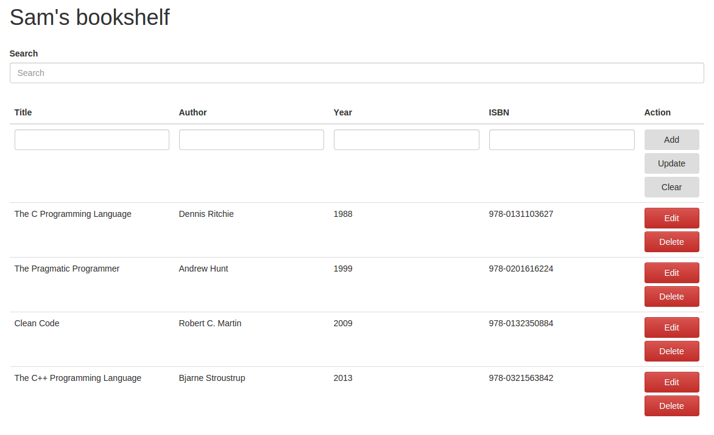

#Bookshelf
A simple MEAN stack bookshelf app to keep track of books I am currently reading or want to read.

Uses express routes to Create, Read, Update and Delete book data objects from a MongoDB database.

AngularJS front-end lists the books in order of year of release and has a search bar for ease of use.

TODO: Add some error handling/testing.
###Usage

To use, clone this repo, run 'npm install' and then 'node server' with Mongo running.

###Bookshelf in action:
